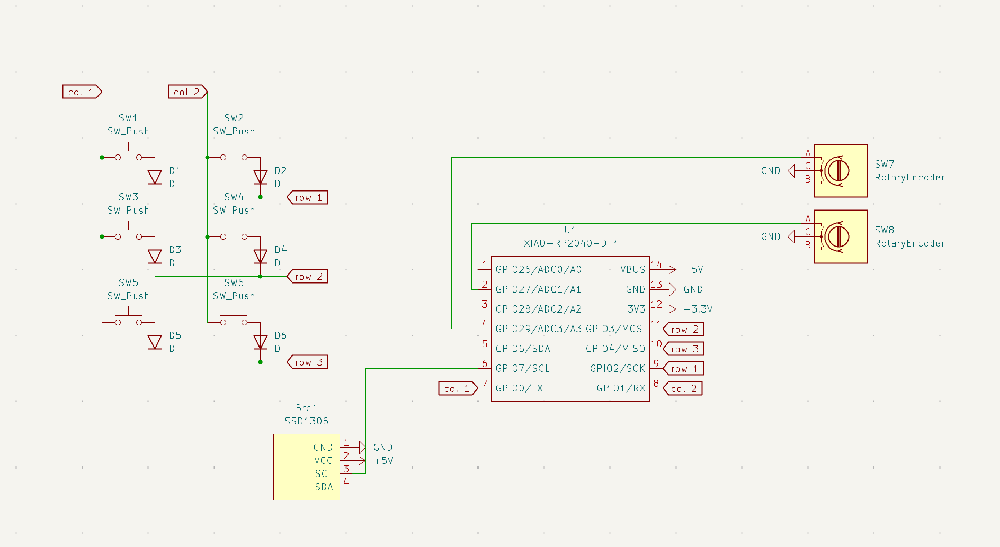
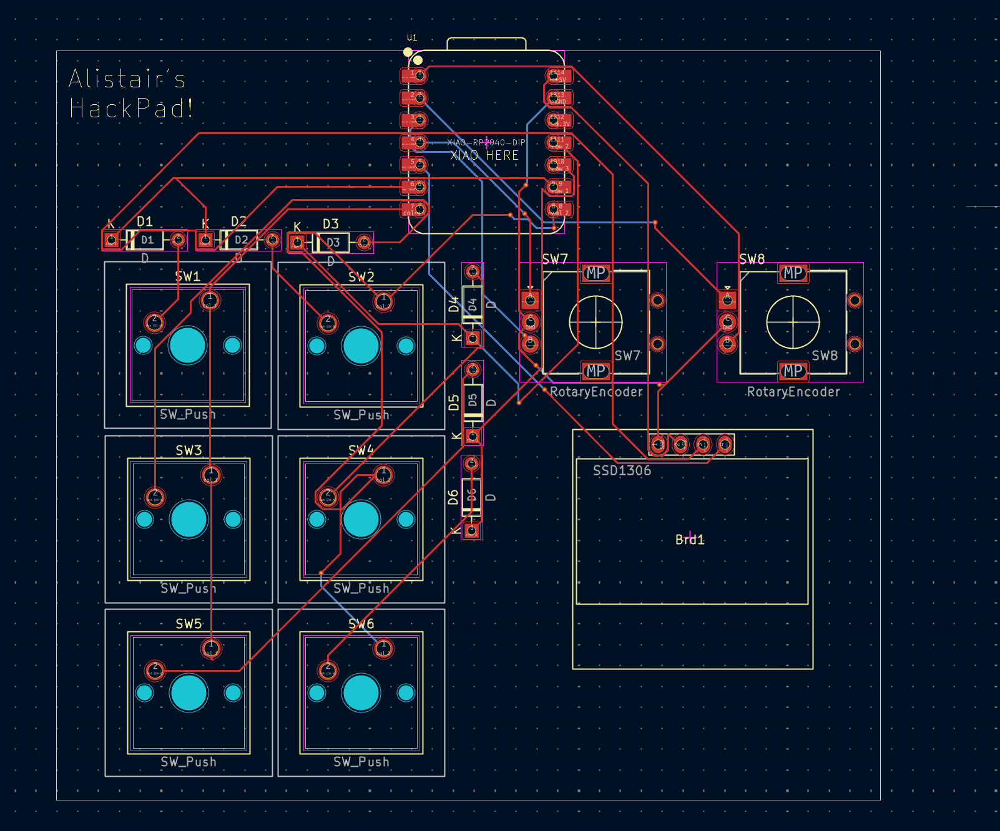
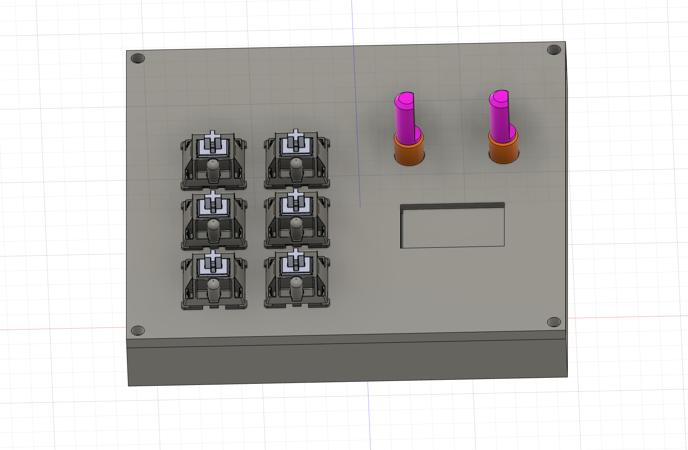

# My HackPad

My HackPad is a 6-key (2x3) macropad built around the Seeed XIAO RP2040. It includes an EC11 rotary encoder for quick control and a 0.91 inch 128x32 I2C OLED display for status and layer info. The goal was a compact daily-driver pad for editing and media control with a clean, beginner-friendly KiCad design.

## Features
- 6x MX-style keys (2 columns x 3 rows matrix)
- EC11 rotary encoder (volume on Layer 0, track control on Layer 1)
- 0.91 inch 128x32 I2C OLED (pin order: GND-VCC-SCL-SDA)
- KMK (CircuitPython) firmware with layers
- 3D-printed case designed to fit the PCB, OLED, and encoder cleanly

## Photos

## Schematic

Notes:
- Keys are wired as a 2x3 matrix with 1N4148 diodes to prevent ghosting.
- OLED uses I2C (SDA/SCL) and is powered from 3.3V.
- Encoder uses two GPIO pins plus GND common.

## PCB

Notes:
- Switches are laid out on standard MX spacing.
- Diodes are placed close to their switches for clean routing.
- XIAO is positioned so the USB port is accessible at the board edge.
- Silkscreen includes the project name plus a "XIAO HERE" orientation label.

## Case and CAD

How it fits together:
- Top plate holds switches and keycaps.
- Middle cavity supports the PCB and provides clearance for solder joints.
- OLED sits above the key cluster.
- Encoder is mounted at the top-right with knob clearance.
- Bottom closes the case and provides mounting points.

(Designed for 3D printing.)

## Firmware Overview (KMK / CircuitPython)
This project uses KMK firmware (Python) for fast iteration.

Default behavior:
- Layer 0:
  - Keys: common editing macros (copy/paste/undo/redo, etc.)
  - Encoder: volume up/down
- Layer 1:
  - Keys: media controls
  - Encoder: previous/next track

Firmware file:
- `firmware/main.py`

## BOM (Bill of Materials)
Everything needed to build this hackpad:

Electronics:
- 1x Seeed XIAO RP2040
- 6x MX-style switches
- 6x 1N4148 diodes (DO-35, through-hole)
- 1x EC11 rotary encoder
- 1x 0.91 inch 128x32 I2C OLED display (pin order: GND-VCC-SCL-SDA)
- 1x 1x4 2.54mm pin header (for the OLED)

Hardware and Case:
- 6x keycaps (DSA or any MX-compatible)
- 3D-printed case (top and bottom, or top/middle/bottom depending on your design)
- Optional, if your case uses M3 hardware:
  - 4x M3x16mm screws
  - 4x M3 heatset inserts (5x4mm)
  - Optional extra screws/inserts depending on your CAD

